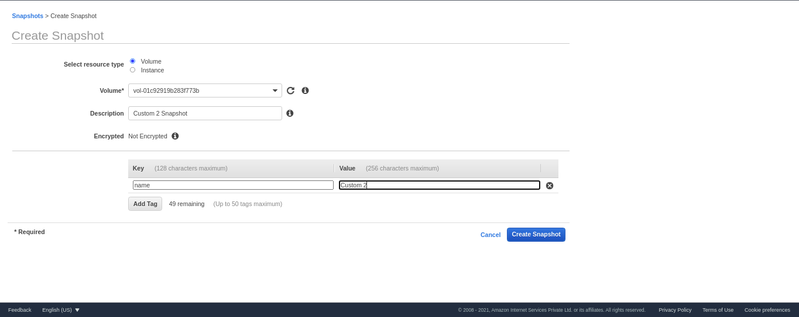
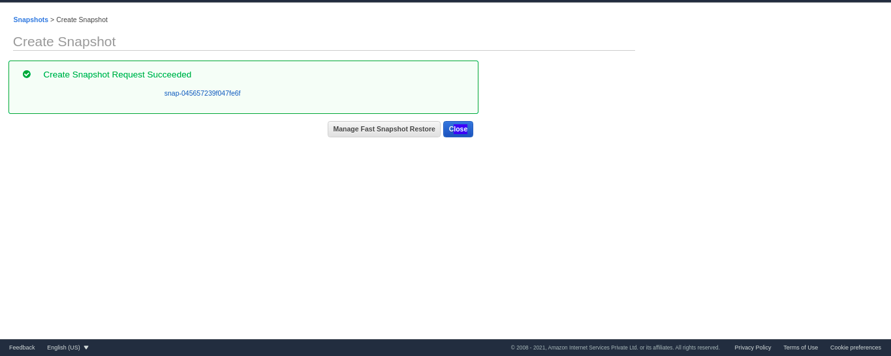

# Configure snapshots for EBS


 ```
 ──(ishu㉿kali)-[~/Downloads]
└─$ aws ec2 create-snapshot --volume-id vol-01c92919b283f773b  --description "This is my Custom 2 Instace root volume snapshot"

{
    "Description": "This is my Custom 2 Instace root volume snapshot",
    "Encrypted": false,
    "OwnerId": "575196606097",
    "Progress": "",
    "SnapshotId": "snap-0a8b5f46fd3435764",
    "StartTime": "2021-07-03T21:36:32.000Z",
    "State": "pending",
    "VolumeId": "vol-01c92919b283f773b",
    "VolumeSize": 8,
    "Tags": []
}
```


## Create Snapshot of Instance By Instance Id


```
┌──(ishu㉿kali)-[~/Downloads]
└─$ aws ec2 create-snapshots \
    --instance-specification InstanceId=i-0e9abd6425e3c2ac4 \
    --description "This is snapshot of a volume from my-instance"
{
    "Snapshots": [
        {
            "Description": "This is snapshot of a volume from my-instance",
            "Tags": [],
            "Encrypted": false,
            "VolumeId": "vol-01c92919b283f773b",
            "State": "pending",
            "VolumeSize": 8,
            "StartTime": "2021-07-03T21:47:06.549Z",
            "Progress": "",
            "OwnerId": "575196606097",
            "SnapshotId": "snap-052e4f1b87176fdd7"
        }
    ]
}
```


## Using Console 





