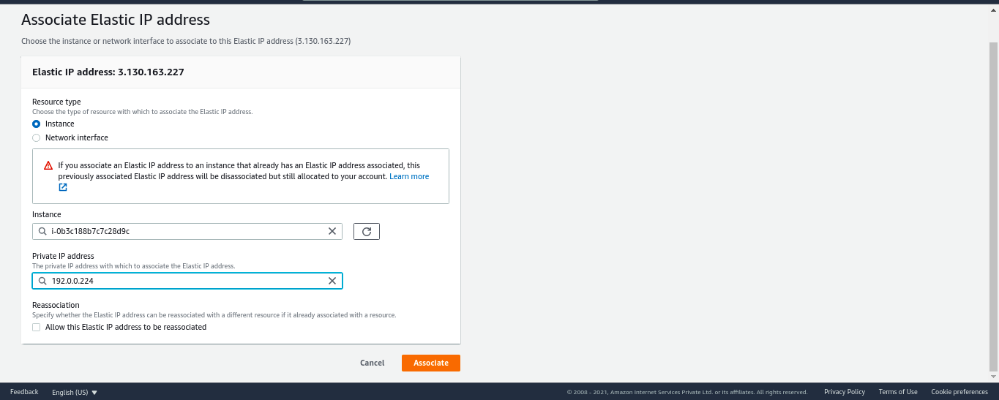

# First Create VPC ( Virtual private cloud )


Note : Enable DNS Hostname In Setting

## Create Subnet 


Security Group is a stateful firewall which can be associated with Instances. Security Group acts like a Firewall to Instance or Instances. Security Group will always have a hidden Implicit Deny in both Inbound and Outbound Rules. So we can only allow something explicitly, but not deny something explicitly in Security Groups.

Note : Enable Auto Assign public IP  Option in subnet 


# Create NACL () Network ACl )

NACLs are stateless firewalls which work at Subnet Level, meaning NACLs act like a Firewall to an entire subnet or subnets. A default NACL allows everything both Inbound and Outbound Traffic. Unlike Security Groups, in NACLs we have to explicitly tell what to deny in Inbound and Outbound Rules. There’s no Implicit Deny in NACL.


# Secondly Get Elastic Ip 


Now You will see a Elastic Static ip in your Dashboard


#  Now Create A Security Group 

Security Group — Security Group is a stateful firewall to the instances. Here stateful means, security group keeps a track of the State. Operates at the instance level.


# Now Create Ec2 Instance With Subnet and Elastic IP


## Attach Elastic IP To the Instance

Befre creating Vpc - you must Create Internet Gateway then attach vpc to it




# Deploy Container in Ec2

## Connet to the Ec2

```shell
ssh -i "custom.pem" ubuntu@ec2-3-13-45-64.us-east-2.compute.amazonaws.com
```

## install Docker 

```shell
sudo apt update
sudo apt install docker.io
```

## Deploy a Container 

```shell
docker run --name nginx-container -d -p 8080:80 nginx
```